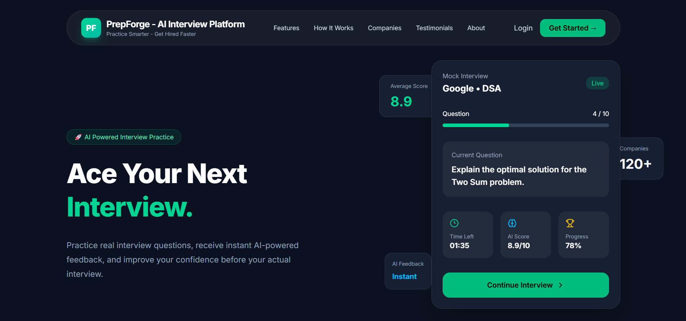
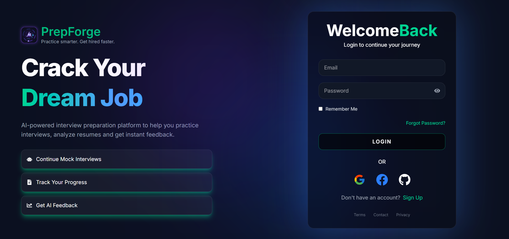
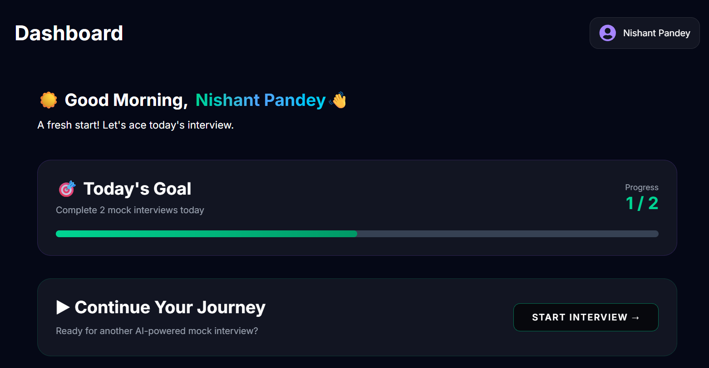
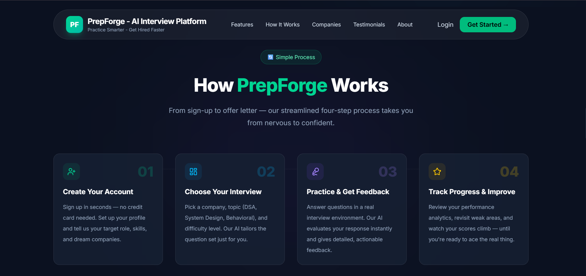

# 🚀 PrepForge – AI Interview Preparation Platform


---

## 🌟 Overview

PrepForge AI is a modern AI-powered interview preparation platform that helps students and professionals prepare for technical and Non-technical interviews using Artificial Intelligence.

The platform provides secure authentication, resume management, AI-generated interview questions, intelligent interview feedback, and background task processing using Celery and Redis.

The entire application is containerized using Docker for easy deployment and scalability.

---

## ✨ Features

## 🔐 Authentication

- User Registration
- User Login
- JWT Authentication
- Google OAuth Login
- Forgot Password
- Reset Password
- Protected Routes

---

## 👤 User Dashboard

- User Profile
- Resume Upload
- Resume Management
- Dashboard Overview

---

## 🤖 AI Features

- AI Interview Questions
- AI Interview Feedback
- Resume Analysis
- AI-powered Response Generation using Groq AI

---

## ⚡ Background Processing

- Celery Worker
- Redis Message Broker
- Async AI Tasks

---

## ☁️ Cloud Storage

- Cloudinary Image Upload
- Resume Storage

---

## 🔒 Security

- JWT Authentication
- Password Hashing
- Environment Variables
- Secure APIs
- Dockerized Deployment

---

## 🏗 System Architecture

```text
                 React + Vite
                      │
                      ▼
                 FastAPI Backend
                      │
       ┌──────────────┼──────────────┐
       ▼              ▼              ▼
 PostgreSQL        Redis        Cloudinary
                      │
                      ▼
                   Celery
                      │
                      ▼
                    Groq AI
```

---

## 🛠 Tech Stack

## Frontend

- React
- Vite
- React Router
- Axios
- Tailwind CSS

---

## Backend

- FastAPI
- SQLAlchemy
- Alembic
- JWT Authentication
- OAuth2

---

## Database

- PostgreSQL

---

## AI

- Groq API

---

## Storage

- Cloudinary

---

## Background Tasks

- Redis
- Celery

---

## Deployment

- Docker
- Docker Compose
- Nginx

---

## 📁 Project Structure

```text
AI-Interview-Platform/

├── backend/
│   ├── app/
│   ├── alembic/
│   ├── requirements.txt
│   ├── Dockerfile
│   └── start.sh
│
├── frontend/
│   ├── src/
│   ├── public/
│   ├── Dockerfile
│   └── nginx.conf
│
├── docker-compose.yml
├── .gitignore
└── README.md
```

---

## ⚙️ Local Installation

## Clone Repository

```bash
git clone https://github.com/Nishant2817/AI-Interview-Platform.git

cd AI-Interview-Platform
```

---

## Backend Setup

```bash
cd backend

python -m venv venv

pip install -r requirements.txt

uvicorn app.main:app --reload
```

---

## Frontend Setup

```bash
cd frontend

npm install

npm run dev
```

---

## 🐳 Docker Setup

Build Docker Images

```bash
docker compose build
```

Run Containers

```bash
docker compose up
```

Run in Background

```bash
docker compose up -d
```

Stop Containers

```bash
docker compose down
```

---

## 🔐 Environment Variables

Create a `.env` file inside the `backend` folder.

Example variables are available in:

```text
backend/.env.example
```

---

## 📸 Application Screenshots

| Home                          | Login                           |

|-------------------------------|----------------------------------|
|  |  |

| Dashboard                               | How It Works                              |
|-----------------------------------------|-------------------------------------------|
|  |  |

---

## 🤝 Contributing

Contributions are welcome.

Fork the repository and submit a Pull Request.

---

## 📄 License

This project is licensed under the MIT License.

---

## 👨‍💻 Developer

Nishant Pandey (FULL STACK DEVELOPER)

GitHub: [Nishant2817](https://github.com/Nishant2817)

LinkedIn: [nishant-pandey-4a2a1b2a1](https://www.linkedin.com/in/nishant-pandey-2b6a062b6/)

Email: [nishantpandey1838@gmail.com](mailto:nishantpandey1838@gmail.com)
